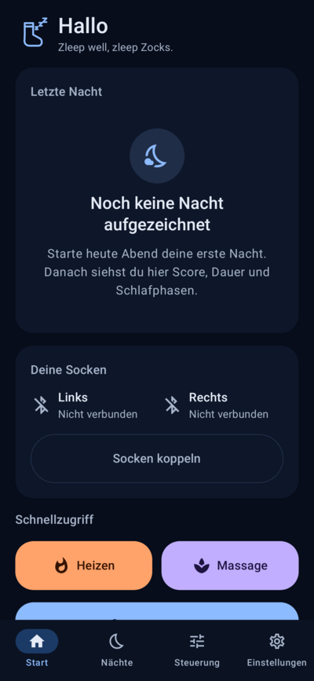
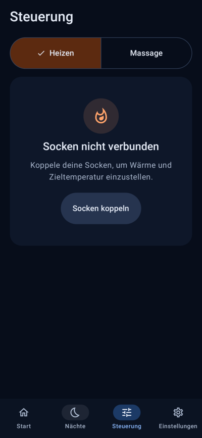
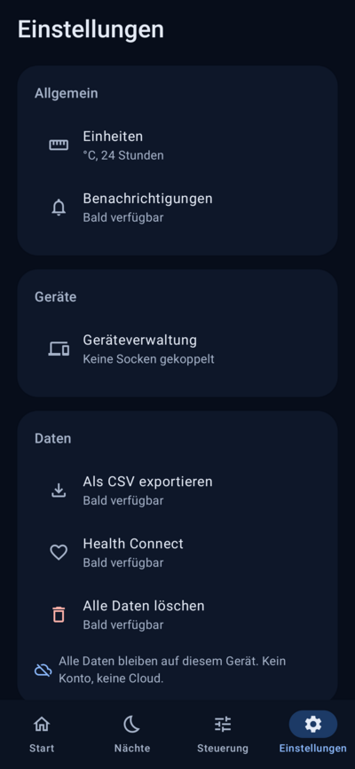

# Zocks Zleep

*Zleep well, zleep Zocks.*

Begleit-App für die smarten Schlafsocken **Zocks**: Fußmassage, Heizen und Schlaftracking
über einen optischen Sensor (PPG). Die App steuert beide Socken per Bluetooth Low Energy,
zeichnet die Nacht auf und zeigt eine übersichtliche Schlafanalyse.

> Zocks Zleep ist ein **Wellnessprodukt, kein Medizinprodukt**. Alle Werte sind Schätzungen.

<p>
  
  
  
</p>

## Grundsätze

- **Offline-first:** Alle Daten bleiben auf dem Gerät. Kein Konto, keine Cloud, keine Backups.
- **Dunkles Design als Standard:** tiefes Nachtblau, warmer Akzent für Wärme, kühler für Schlaf.
- **Daumentauglich:** Bedienelemente für Heizen und Massage sind mindestens 64 dp hoch.
- **Keine erfundenen Messwerte:** Was der Sensor nicht liefert, wird als „nicht verfügbar“ gezeigt.
- **Sprache:** Deutsch (Standard), Englisch als zweite Sprache.

## Technik

| Bereich | Wahl |
|---|---|
| Sprache / UI | Kotlin 2.4, Jetpack Compose, Material 3, Single-Activity |
| Navigation | Navigation Compose mit typsicheren Routen (`kotlinx.serialization`) |
| Architektur | MVVM, Schichten `ui / domain / data / device` |
| DI | Hilt |
| Asynchronität | Coroutines + Flow |
| Persistenz | Room (Messdaten, Nächte), DataStore (Einstellungen) |
| Diagramme | Vico (Trends), eigenes Compose-Canvas (Nachtverlauf, Hypnogramm) |
| SDK | minSdk 26, targetSdk / compileSdk 37 |
| Build | Gradle 9.8, AGP 9.4, Version Catalog `gradle/libs.versions.toml` |

## Aufbau

```
app/src/main/java/at/zocks/zleep/
├── ZocksApplication.kt      Hilt-Einstieg
├── MainActivity.kt          einzige Activity, Splash, Edge-to-Edge
├── ui/                      Compose-Screens, ViewModels, Theme, Navigation
│   ├── theme/               Farben, Typografie, Abstände, ZocksTheme
│   ├── navigation/          typsichere Routen, Ziele der unteren Leiste
│   ├── components/          Karten, große Aktionsknöpfe, Lade-/Leer-/Fehlerzustände
│   ├── home/ nights/ control/ settings/ routine/
│   ├── onboarding/          Einrichtung beim ersten Start
│   ├── alarm/               Vollbild des klingelnden Weckers
│   ├── developer/           Entwickleroptionen (Simulator, Demo-Daten)
│   ├── nightdetail/         Nachtdetail
│   └── format/              Zahlen, Zeiten, Einheiten, Übersetzungen
├── domain/                  reines Kotlin
│   ├── model/               Nacht, Epochen, Schlafphasen, Geräte-Modelle, Einstellungen
│   ├── device/              SockDevice, SockPair, SockPairProvider
│   ├── repository/          Repository-Interfaces
│   ├── simulator/           Steuerung von Simulator und Demo-Daten
│   ├── heat/                HeatSafetyGuard, HeatController, Vorwärmen
│   ├── massage/             Programme, Muster, MassageController
│   ├── sleep/               Live-Erkennung „eingeschlafen“
│   ├── control/             ControlCoordinator (Einstellungen ↔ Regler)
│   ├── recording/           NightRecorder, EpochAggregator, NightAnalyzer
│   ├── analysis/            Schlafphasen-Heuristik, Schlaffenster, Kennzahlen, Score, Trends
│   ├── routine/             Abendroutine (EveningRoutine, RoutineRunner)
│   ├── alarm/               smarter Wecker (Fenster, Entscheidung, SmartAlarmController)
│   ├── export/              CSV-Export
│   └── health/              Health-Connect-Export (Zuordnung, HealthExporter)
├── data/                    Room (db/), Repositories, DataStore (settings/), Vorwärmen (schedule/),
│                            Health Connect (health/), Dateiexport (export/)
├── device/                  Simulator (simulator/), Aufzeichnungsdienst (recording/), Wecker (alarm/),
│                            BLE (ble/, ab Phase 7)
└── di/                      Hilt-Module
```

Die Domain-Schicht darf nichts aus Android, `ui`, `data` oder `device` importieren.
`DomainPurityTest` prüft das bei jedem Testlauf.

## Bauen und testen

Voraussetzungen: JDK 21, Android SDK mit Plattform 37 (`platforms;android-37.0`).

```bash
./gradlew assembleDebug        # Debug-APK → app/build/outputs/apk/debug/
./gradlew testDebugUnitTest    # Unit- und UI-Tests (Robolectric, ohne Emulator)
./gradlew lintDebug            # Android Lint
```

Die Debug-App hat die ID `at.zocks.zleep.debug` und kann neben einer späteren
Release-Version installiert sein. Der Debug-Schlüssel liegt im Repo (`app/debug.keystore`),
damit sich jede CI-APK über die vorherige installieren lässt.

## APK aufs Handy laden

Jeder Push startet den Workflow **CI** (`.github/workflows/ci.yml`): bauen, testen, Lint.
Danach liegt die Debug-APK unter *Actions → letzter Lauf → Artifacts →
`zocks-zleep-debug-apk`*. ZIP herunterladen, entpacken, APK auf dem Handy öffnen
(„Installation aus unbekannten Quellen“ einmalig erlauben).

## Stand der Phasen

| Phase | Inhalt | Stand |
|---|---|---|
| 1 | Projektgerüst, Theme, Navigation, CI | ✅ fertig |
| 2 | Datenmodell, Room, Simulator mit Demo-Nächten | ✅ fertig |
| 3 | Gerätesteuerung: Heizen und Massage | ✅ fertig |
| 4 | Nachtaufzeichnung mit Foreground Service | ✅ fertig |
| 5 | Analyse, Score, Diagramme, Trends | ✅ fertig |
| 6 | Abendroutine, smarter Wecker, Health Connect, Export | ✅ fertig |
| 7 | BLE-Implementierung, Feinschliff, Tests | ⏳ offen |

### Phase 1 – enthalten

- Gradle-Projekt mit Version Catalog, Hilt, KSP, Compose, Navigation, Splash Screen
- Theme „Nacht“ (dunkel als Standard) mit fachlichen Farben für Wärme, Schlaf, Massage
  und Schlafphasen (`ZocksThemeExt.colors`)
- Untere Navigation: Start, Nächte, Steuerung, Einstellungen
- Startseite mit Leerzustand „letzte Nacht“, Sockenstatus links/rechts, Schnellzugriff
- Steuerung mit Reitern Heizen/Massage (Schnellzugriff öffnet direkt den passenden Reiter)
- Einstellungen mit Hinweis „Wellnessprodukt, kein Medizinprodukt“
- Logo als Vektor (Socke mit „zzz“), adaptives Launcher-Icon inkl. Monochrom-Variante
- Wiederverwendbare Lade-, Leer- und Fehlerzustände
- Texte in Deutsch und Englisch, App-Sprache pro App wählbar (Android 13+)
- Keine Cloud-Backups (`data_extraction_rules.xml`)
- Tests: Domain-Reinheit, Begrüßungslogik, Navigations-UI-Tests (Hilt + Robolectric)
- CI mit Debug-APK als Artefakt

### Phase 2 – enthalten

- **Datenmodell:** Nächte, 30-s-Epochen je Socke (Puls, HRV, SpO2, Hauttemperatur,
  Bewegung – jeweils `null`, wenn nicht gemessen), Schlafphasen, Ereignisse (Wärme,
  Massage, Routine, Wecker, Sicherheitsabschaltung), Verbindungslücken, Tags, Notizen.
- **Room** mit Schema-Export, eingebaute Tags (Koffein, Sport, Alkohol, Stress, spätes
  Essen, Bildschirmzeit), **DataStore** für Einstellungen.
- **Geräteschicht:** `SockDevice` je Socke, `SockPair` (gemeinsam oder getrennt),
  `SockPairProvider` wählt Simulator oder echtes Gerät.
- **Simulator:**
  - Nachtgenerator mit Schlafzyklen von 85–110 min (Tiefschlaf früh, REM spät) und
    phasentypischem Puls, HRV, SpO2, Fußtemperatur und Bewegung.
  - `SimulationEngine` in Echtzeit oder als Zeitraffer-Nacht (60×, 300×, 1200×).
  - `SimulatedSockDevice` reagiert auf Heizen (Heizelement und Haut erwärmen sich),
    Massage (Vibration, sanftes Ausklingen), verbraucht Akku und simuliert Verbindungsabbrüche.
- **Demo-Datensatz:** 30 Nächte mit Tags, Wärme- und Massage-Ereignissen und
  gelegentlichen Lücken. Eingebaute Zusammenhänge (z. B. Koffein → längeres Einschlafen)
  machen spätere Trends und Erkenntnisse sichtbar.
- **UI:**
  - Start zeigt die letzte Nacht und den echten Sockenstatus (Verbinden/Trennen).
  - Nächte als Liste, einfache Nachtdetailseite mit Kennzahlen.
  - Entwickleroptionen mit Simulator-Umschalter, Live-Werten, Zeitraffer-Nacht und
    Demo-Daten.
- **Tests (49):** Nachtgenerator, simulierte Socke, Engine, Demo-Daten, Room-Repository,
  DataStore, Kennzahlen, `SockPair`, UI-Abläufe (Verbinden, Demo laden → Nacht öffnen,
  Gerätemodus wechseln).

### Phase 3 – enthalten

- **Heizen** (*Steuerung → Heizen*):
  - Stufe 1–5 oder Zieltemperatur 20–40 °C in 0,5-°C-Schritten.
  - Beide Socken gemeinsam oder einzeln.
  - Timer 15–90 min, „Aus, sobald ich eingeschlafen bin“ (Bewegungs-Erkennung).
  - Tägliches Vorwärmen zur festen Uhrzeit (Systemwecker, auch nach Neustart).
- **Sicherheit** (`HeatSafetyGuard`, jeder Befehl und jeder Messwert läuft hindurch):

  | Regel | Wert |
  |---|---|
  | Zieltemperatur | auf 20–40 °C begrenzt |
  | Harte Abschaltung | Haut oder Heizelement > 42 °C |
  | Laufzeit | max. 90 min am Stück, danach 15 min Pause |
  | Unplausibel | < 10 °C, > 50 °C, Sprung > 3 °C in 10 s, > 30 s kein Wert |
  | Ohne Temperatursensor | wird gar nicht geheizt |

  Abschaltungen erscheinen als Meldung auf jedem Screen. Solange geheizt wird, zeigt ein
  oranges Band oben die Restzeit und einen Stopp-Knopf.
- **Massage** (*Steuerung → Massage*):
  - Programme Entspannung, Welle, Kneten, Pulsieren, Erholung (links/rechts im Wechsel),
    Intensiv, Sleep Mode.
  - Muster über die vier Zonen Ferse, Gewölbe, Ballen, Zehen.
  - Intensität (sofort wirksam), Dauer, Seite, Favoriten.
  - Eigene Programme (Art, Tempo, Zonen) speichern und löschen.
  - Sanftes Ausklingen am Ende (Sleep Mode: halbe Dauer, max. 5 min).
- **Daten:** eigene Programme in Room (Schema v2 mit Migration und Migrationstest),
  Einstellungen und Favoriten in DataStore.
- **Entwickleroptionen:** „Sensorfehler links/rechts“ löst die Sicherheitsabschaltung aus.
- **Tests (100):** u. a. Sicherheitsregeln, Heiz- und Massageregler in virtueller Zeit,
  Schlaferkennung, Muster, Migration, UI-Abläufe (Heizen mit Band, Abschaltung bei
  Sensorfehler, Zieltemperatur, Massage, Favoriten, eigene Programme).

> Die Sicherheitslogik der App ergänzt die Absicherung in der Firmware, sie ersetzt sie nicht.

### Phase 4 – enthalten

- **Nacht starten:** Checkliste „Bereit für die Nacht?“ (Socken verbunden, Benachrichtigungen,
  „Geräte in der Nähe“, Akku-Optimierung) – jede Berechtigung mit kurzer Erklärung, erst auf
  Wunsch angefragt.
- **Aufzeichnung im Vordergrunddienst** (Typ „verbundenes Gerät“) mit ruhiger Benachrichtigung
  und „Nacht beenden“, Teil-Wakelock, Neustart durch das System (`START_STICKY`) setzt die
  offene Nacht fort, ebenso der nächste App-Start.
- **Robust bei Abbrüchen:** Verbindungslücken je Socke werden markiert, abgerissene
  Verbindungen automatisch neu aufgebaut (2 s, 5 s, 10 s, 30 s, dann minütlich).
- **Messwerte** je Socke als 30-s-Epochen: Puls, HRV, SpO2 (wenn vorhanden), Hauttemperatur,
  Bewegung. Wärme- und Massagezeiten sowie Sicherheitsabschaltungen werden in der Nacht markiert.
- **Schlafphasen** (wach/leicht/tief/REM) über `SleepStageClassifier`; die Heuristik ist in
  `HeuristicSleepStageClassifier` dokumentiert (Aktigraphie + Puls/HRV relativ zur eigenen
  Nacht). Gegen den Simulator: ~92 % Übereinstimmung. Mit echten Sockendaten neu kalibrieren.
- **Einschlafen/Aufwachen** automatisch (`SleepWindowDetector`), von Hand korrigierbar
  (Nachtdetail, Stift-Symbol); „Automatisch“ hebt die Korrektur wieder auf.
- **Automatisches Ende:** nach ≥ 3 h Schlaf und 30 min Wachsein, spätestens nach 16 h.
  Aufzeichnungen unter 10 min werden verworfen.
- **Nachtmodus:** fast schwarz, große Uhr, ohne untere Leiste.
- Datenbank Schema v3 (Merker „von Hand korrigiert“) mit Migrationstest.

**Grenzen:** Ab Android 14 braucht der Hintergrunddienst „Geräte in der Nähe“. Ohne diese
Berechtigung läuft die Aufzeichnung nur, solange die App offen ist (die App sagt das).

### Phase 5 – enthalten

- **Schlafscore 0–100** aus fünf nachvollziehbaren Teilen, jeweils linear zwischen zwei
  Schwellen (`SleepScoreCalculator`):

  | Teil | Punkte | 0 Punkte | volle Punkte |
  |---|---|---|---|
  | Dauer | 35 | ≤ 50 % des Schlafziels | ≥ 100 % |
  | Effizienz | 25 | ≤ 65 % der Zeit im Bett | ≥ 90 % |
  | Tief- + REM-Schlaf | 20 | ≤ 15 % des Schlafs | ≥ 40 % |
  | Einschlafen | 10 | ≥ 60 min | ≤ 15 min |
  | Durchschlafen | 10 | ≥ 60 min wach | ≤ 10 min wach |

  Fehlen Messwerte für einen Teil, wird er weggelassen und der Rest hochgerechnet. Die
  Nachtansicht zeigt jeden Teil mit Punkten, Balken und dem zugrunde liegenden Wert.
- **Kennzahlen** je Nacht (`NightSummarizer`): Einschlafdauer, Schlafeffizienz, Wachphasen
  (ab 1 min) und Wachzeit, Ruhepuls (ruhigster 5-Minuten-Abschnitt im Schlaf, beide Socken
  gemittelt), Phasenanteile, Durchschnittswerte. Fehlende Werte bleiben „nicht verfügbar“.
  Sie werden in `night_summaries` zwischengespeichert (Schema v4) und nach Auswertung,
  Korrektur und Demo-Import aktualisiert; fehlende werden beim Start nachgetragen.
- **Nachtverlauf:** Hypnogramm in vier Bahnen, darunter wahlweise Puls, HRV oder
  Fußtemperatur (nie zwei Skalen gleichzeitig), Wärme- und Massage-Streifen,
  Verbindungslücken hinterlegt. Antippen/Wischen zeigt die Werte zum Zeitpunkt; alles auch
  als Tabelle (30-Minuten-Schritte).
- **Nächte-Tab:** Liste mit Score, Monatskalender (Score als Zahl plus Farbstufe),
  Trends für Woche, Monat und Jahr (Ø Score, Ø Schlafdauer, Ø Ruhepuls, Regelmäßigkeit der
  Einschlaf- und Aufwachzeiten) mit Säulendiagrammen (Vico) und Ziellinie.
- **Erkenntnisse** (`InsightEngine`): Vergleich von Nächten mit und ohne Wärme, Massage oder
  Tag – erst ab 14 ausgewerteten Nächten und mindestens 5 je Gruppe, nur deutliche
  Unterschiede, formuliert als Zusammenhang („im Schnitt … als in Nächten ohne“).
- **Tags und Notiz** in der Nachtansicht bearbeiten, eigene Tags anlegen.
- **Start:** letzte Nacht mit Score, Dauer und Phasenbalken.
- Farben der Schlafphasen neu gewählt und für Farbsehschwächen geprüft (hell und dunkel).

### Phase 6 – enthalten

- **Einrichtung** beim ersten Start: kurze Erklärung (mit Hinweis „kein Medizinprodukt“),
  Socken koppeln, Schlafens- und Aufstehzeit, Schlafziel (Vorschlag aus den Zeiten), smarter
  Wecker. Jeder Schritt lässt sich überspringen; in den Einstellungen erneut aufrufbar.
- **Abendroutine** (Steuerung → Routine): bis zu 8 Schritte aus Wärme (Stufe), Massage
  (Programm, Intensität), beidem oder Pause, je 5–60 min, frei sortierbar. Endet auf Wunsch,
  sobald Schlaf erkannt wird (Bewegung), und schaltet dann Wärme ab und lässt die Massage
  ausklingen. Wärme läuft dabei über den Sicherheitswächter: aufeinanderfolgende Wärme-Schritte
  zählen als ein Heizen, nach 90 min ist Schluss. Lässt sich mit der Nacht mitstarten.
- **Smarter Wecker** während der Aufzeichnung: Fenster (10–45 min) vor der Aufstehzeit; im
  Fenster wertet der Recorder jede Minute aus und weckt, sobald die Phase „leicht“ oder „wach“
  ist, spätestens am Fensterende. Wecken per Ton, sanfter Massage oder erst Massage und nach
  3 min Ton; ohne verbundene Socken immer mit Ton. Klingeln als Vollbild (auch über dem
  Sperrbildschirm) mit „Aus“ und „Schlummern“ (9 min). Ausfallsicherung: ein exakter
  Systemwecker auf dem Fensterende – er weckt auch, wenn die App beendet wurde (Freigabe
  „Wecker und Erinnerungen“ nötig; ohne sie kann er sich verspäten).
- **Einstellungen:** Temperatur °C/°F, 24-h-Uhr, Schlafziel, Schlafens- und Aufstehzeit,
  Benachrichtigungen, Wecker, Geräte, CSV-Export, Health Connect, alle Nächte löschen.
- **CSV-Export** über die Dateiauswahl des Systems: `Nächte` (eine Zeile pro Nacht mit
  Kennzahlen, Score, Tags, Notiz) und `Messwerte` (je Socke und 30-s-Epoche mit Phase).
  Format: RFC 4180, Komma als Trenner, Punkt als Dezimalzeichen, Zeitpunkte ISO 8601 mit
  Offset, UTF-8; fehlende Werte bleiben leer.
- **Health Connect** (optional): schreibt Schlafsession mit Phasen und Puls (nur Schreiben,
  nichts Lesen), auf Wunsch nach jeder Nacht automatisch. Nur echte Nächte vom Gerät –
  Demo- und Simulator-Nächte nie. Erneutes Übertragen ersetzt statt zu verdoppeln.

**Grenzen:** Im Simulator (Zeitraffer) gibt es keine Ausfallsicherung über den Systemwecker,
weil die echte Uhr nicht zur simulierten Nacht passt. Der Wecker klingelt über eine
Benachrichtigung; ohne Erlaubnis für Benachrichtigungen nur, solange die App offen ist.

### Simulator ausprobieren

*Einstellungen → Entwickleroptionen:*
1. „Socken verbinden“ (Live-Werte erscheinen),
2. „Nacht abspielen“ (Zeitraffer wählen),
3. „30 Demo-Nächte laden“ (danach unter *Nächte*),
4. unter *Steuerung* heizen, dann hier „Sensorfehler links“ → Sicherheitsabschaltung,
5. auf der Startseite „Nacht starten“, dann hier „Nacht abspielen“ (1200×): nach wenigen
   Minuten erkennt die App den Schlaf und beendet die Nacht morgens selbst.

Bis die Bluetooth-Anbindung steht (Phase 7), ist der Simulator Standard.

## Hardware-Annahmen

- Jede Socke hat ein eigenes, abnehmbares Elektronikmodul (ESP32, BLE) → zwei BLE-Geräte pro Paar.
- Vibrationsmotoren an Ferse, Fußgewölbe, Ballen und Zehen; Heizpads im vorderen Fußbereich.
- Zieltemperatur 20–40 °C. Die Sicherheitslogik der App ersetzt **keine** Absicherung in der Firmware.
